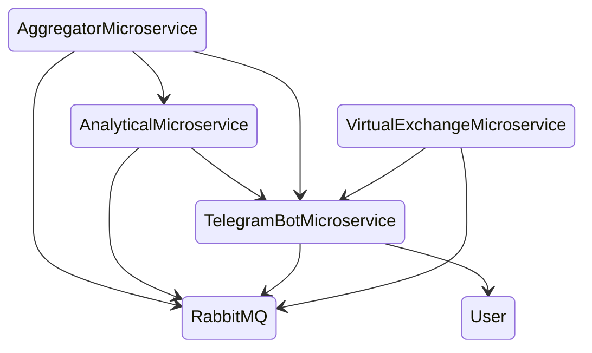

# EVE Explorer

  

  Project for a set of tools for trading, transportation, crafting and game research EVE Online 

# Context: 

  &nbsp;
  &nbsp;
  &nbsp;  
  &nbsp;
  &nbsp;
  &nbsp;
  &nbsp;
  &nbsp;

Microservices planned 

* AggregatorMicroservice 
* AnalyticalMicroservice 
* TelegramBotMicroservice 
* VirtualExchangeMicroservice

# AggregatorMicroservice

the aggregator is responsible for the accumulation of primary data, which are made in the context of 5 minutes.
This allows you to get a detailed report on the change in the positions of market orders within one day.
Provides different raw data to other microservices

# AnalyticalMicroservice

Planned functionality

* Arbitrage trading module
* Depth of Market module
* Price change module relative to the timestamp
* Module of bulls and bears, the ratio of trading volumes.
* Craft analytics
* Carrier destruction statistics with this cargo
* Period Trend Formation Module

# TelegramBotMicroservice 

The bot provides user interaction functionality, and provides all the features of the following microservices
* AnalyticalMicroservice
* VirtualExchangeMicroservice

# VirtualExchangeMicroservice

Trade microservice.
A virtual exchange is planned that will allow trading on the real market of the game, goods that are available in the game.
In single player mode or competing with other players.
In order to learn how to trade without risks in the game market EVE ONLINE
